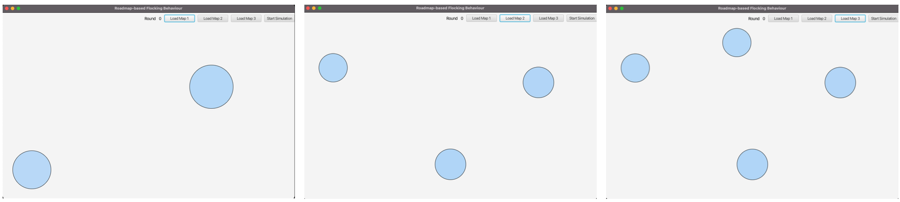

# Roadmap-based flocking behaviors
This is a master's degree project of Distributed Systems developed in 2022.  
Both the code's documentation and some videos (in the `Media` folder) are provided to better describe the system.
The code is also commented with JavaDOC.
## Goal
The goal of this project is to simulate the boids behaviors to do the main tasks roadmap-based which are:
- homing rule
- covering
- goal searching
- sheperding
## Software
The software used for the simulation is developed with [ActoDeS](https://www.matec-conferences.org/articles/matecconf/abs/2016/39/matecconf_cscc2016_04043/matecconf_cscc2016_04043.html) and the simulation is performed involving 50, 100 and 200 boids. 
Thanks to the log generated by the software, a graphical representations of the simulations are provided during their executions like the following example.

The tasks mentioned above are then simulated with the following 3 different maps manually created with JavaFX.

## Demo
<video src='https://user-images.githubusercontent.com/22591922/200111910-8ede6c41-cc83-42fd-9617-8cc5d7a8f51d.mov' width=200></video>

