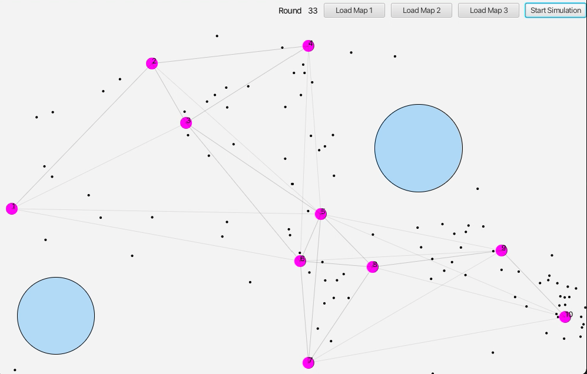

# Distributed-Systems-Project
## Goal
The goal of this project is to simulate the boids behaviors to do the main tasks roadmap-based which are:
- homing rule
- covering
- goal searching
- sheperding
## Software
The software used for the simulation is developed with ActoDeS and the simulation is performed involving 50,100 and 200 boids. 
Thanks to the log generated by the software, a graphical representation of the simulations is provided during their executions like the following example.
 

 
The tasks mentioned above are then simulated with at least 3 different maps manually created with JavaFX.

Both the code's documentation and some videos (in the `Media` folder) are provided to better describe the system.
